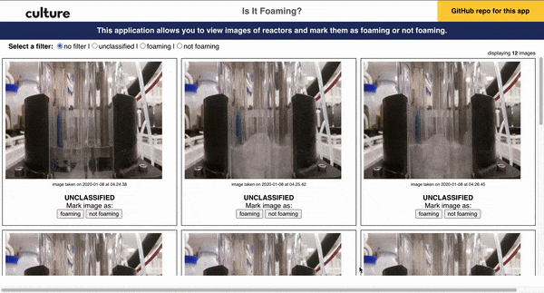
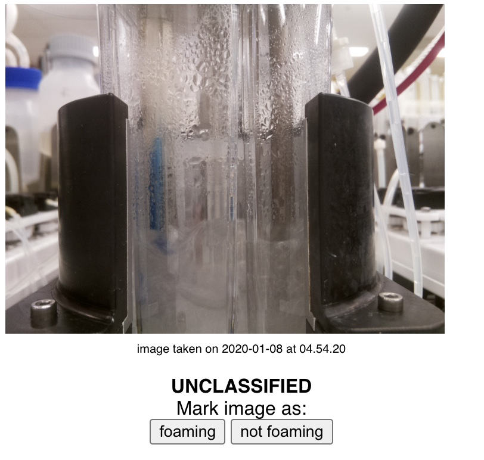
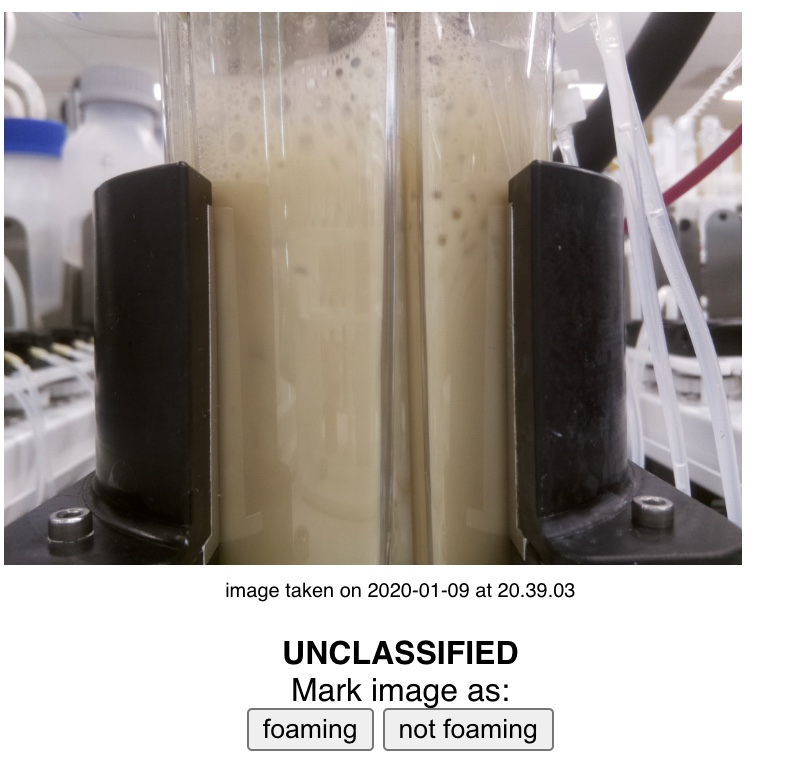
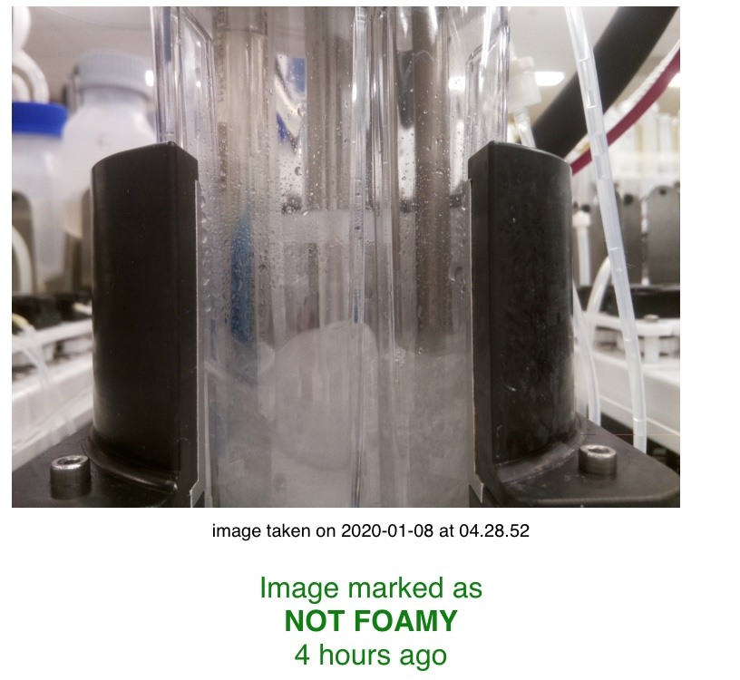
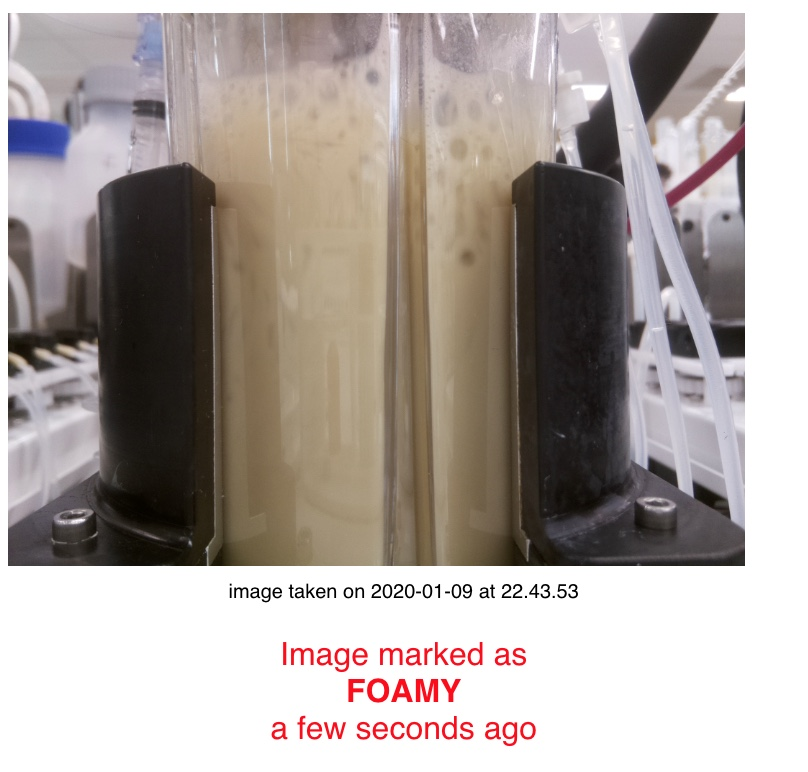

# Is It Foaming?
## Intro
> An application for bioscientists to view images of reactors and mark them as foaming or not foaming.
## User Experience
> The user can:
> 1. view images of reactors
> 2. tag images as foaming or not
> 3. tags are stored in database for persistence
> 4. filter images by:
>    - foaming, not foaming, unclassified or no filter
## Demo

## Example
| Not Foaming | Foaming |
|---|---|
|||
|||
## Tech Stack
> * React
> * create-react-app
> * Express
> * Node
> * dayjs
> * Axios
> * PostgreSQL

## Pre-Requirements
* have Node installed
* have postgreSQL installed
## Local Setup
> 1. `git clone git@github.com:thehimmat/is-it-foaming.git`
> 2. `cd is-it-foaming && npm install`
> 3. `cd isItFoaming && npm install`
> 4. `cd .. && psql -d postgres < initdb.sql`
> 5. `npm start`

## Uninstallation
> * delete `node_modules` folder in is-it-foaming and after using the application
### Known Bug
> When viewing images by the "unclassified" filter, images aren't immediately removed and marked. The bandaid solution was to force the filter to change to whatever the image was tagged as. Those images still stay in the unclassified filter view until refresh.
## Creator
> Himmat Khalsa
> * [GitHub](github.com/thehimmat)